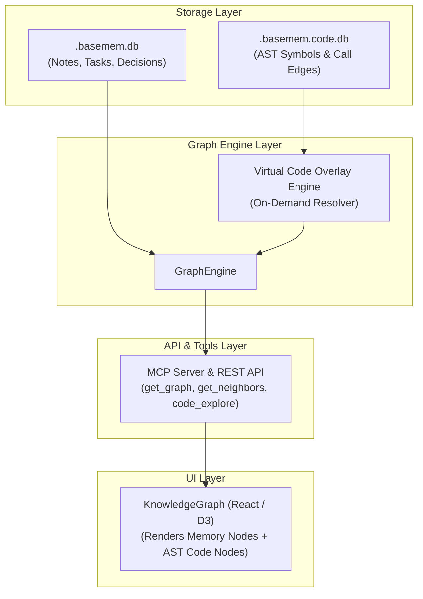

# Design Spec: AST Call-Graph Indexing Integration into BaseMem Graph Nodes

**Date:** 2026-08-11  
**Topic:** BaseMem  
**Task:** Task-42 (AST Call-Graph Indexing into BaseMem Graph Nodes)  

---

## 1. Overview & Goals

BaseMem currently stores high-level project memory (notes, decisions, tasks) in `.basemem.db` and low-level code symbols and call graph relationships in `.basemem.code.db`.

This feature integrates AST symbol & dependency call-graphs directly into BaseMem's Graph Engine as **On-Demand Virtual Graph Nodes**. Users and agents can view, query, and traverse memory notes alongside real AST code symbols (`functions`, `methods`, `classes`, `modules`) and edges (`calls`, `called_by`, `imports`, `declared_in`) without duplicating data or bloating SQLite storage.

---

## 2. Architecture & Design

### 2.1 Virtual Node Materialization & Normalization

Virtual AST nodes from `.basemem.code.db` are normalized into BaseMem graph models on demand.

* **Virtual Node ID Schema**: `code:<symbol_name_or_id>` (e.g. `code:CodeIndexer._index_file` or `code:102`)
* **Node Types**: `function`, `method`, `class`, `module`, `struct`, `interface`
* **Edge Types**: `calls`, `called_by`, `imports`, `declared_in`, `REFERENCES_CODE`
* **Node Attributes**:
  * `title`: Symbol name (e.g., `CodeIndexer._index_file`)
  * `kind`: `symbol` (with sub-kind: `function`, `class`, `method`, `module`)
  * `metadata`: `{ file_path, start_line, end_line, language, signature, docstring }`

---

## 3. Core Component Changes

### 3.1 `indexer/indexer.py` (`CodeIndexer`)
* Implement `get_virtual_graph_neighbors(symbol_name_or_id, depth=1, limit=50)`:
  * Queries `code_symbols` and `code_edges` in `.basemem.code.db`.
  * Returns normalized dictionary of virtual nodes and edges.

### 3.2 `graph/engine.py` (`GraphEngine`)
* Extend `get_neighbors(node_id, depth=1, include_code=True, max_code_nodes=50)`:
  * Merges memory graph neighbors with virtual code AST graph nodes.
* Implement cross-link bridge detection:
  * Automatically creates virtual `REFERENCES_CODE` bridge edges connecting memory notes that mention indexed symbol names to their respective virtual code AST nodes.

### 3.3 `server.py` & `mcp_server/server.py`
* Update `get_graph` and `get_neighbors` endpoints and MCP tools:
  * Accept `include_code: bool = True` and `code_depth: int = 1`.
  * Support filtering by symbol type and file path prefix.
* Enrich `code_explore` MCP tool response to include call-graph neighborhood subtrees.

### 3.4 Frontend (`KnowledgeGraph.tsx` & `DotNode.tsx`)
* Add visual styling for AST code nodes (distinct colors, icons/badges for functions, classes, methods).
* Support rendering `calls` and `imports` directed edges.

---

## 4. Performance & Safety Guards

* **Max Virtual Code Node Cap**: Hard default limit of `max_code_nodes = 50` per graph query to prevent canvas lag.
* **Graceful Fallback**: If `.basemem.code.db` is not present, graph traversal returns standard memory nodes cleanly without throwing exceptions.

---

## 5. Testing & Verification

1. **Unit Tests (`tests/test_graph_code_overlay.py`)**:
   * Verify virtual node/edge materialization from `.basemem.code.db`.
   * Verify `GraphEngine.get_neighbors(include_code=True)` traversal.
   * Verify auto-bridge linking between memory notes mentioning code symbols and AST nodes.
2. **MCP Tool Tests (`tests/test_mcp_tools.py`)**:
   * Test `get_graph(include_code=True)` returns unified memory + AST code nodes and edges.
3. **Full Test Suite Verification**:
   * Ensure all existing 220 tests pass with zero regressions (`uv run --with pytest pytest`).
